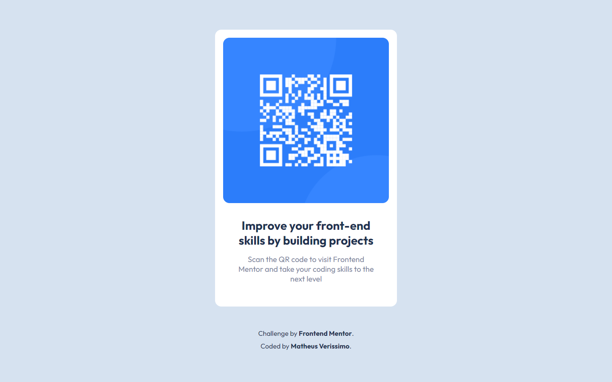

# Frontend Mentor - QR code component

Esta é uma solução para o [QR code component challenge on Frontend Mentor](https://www.frontendmentor.io/challenges/qr-code-component-iux_sIO_H).

## Screenshots

## Links

Link: https://mveryy.github.io/QR-code-component/

## Aprendizados

Treinei o uso do Flexbox e responsividade.

## Construído com

-   HTML5
-   CSS3

## Autores

-   [@Mveryy](https://github.com/Mveryy)
